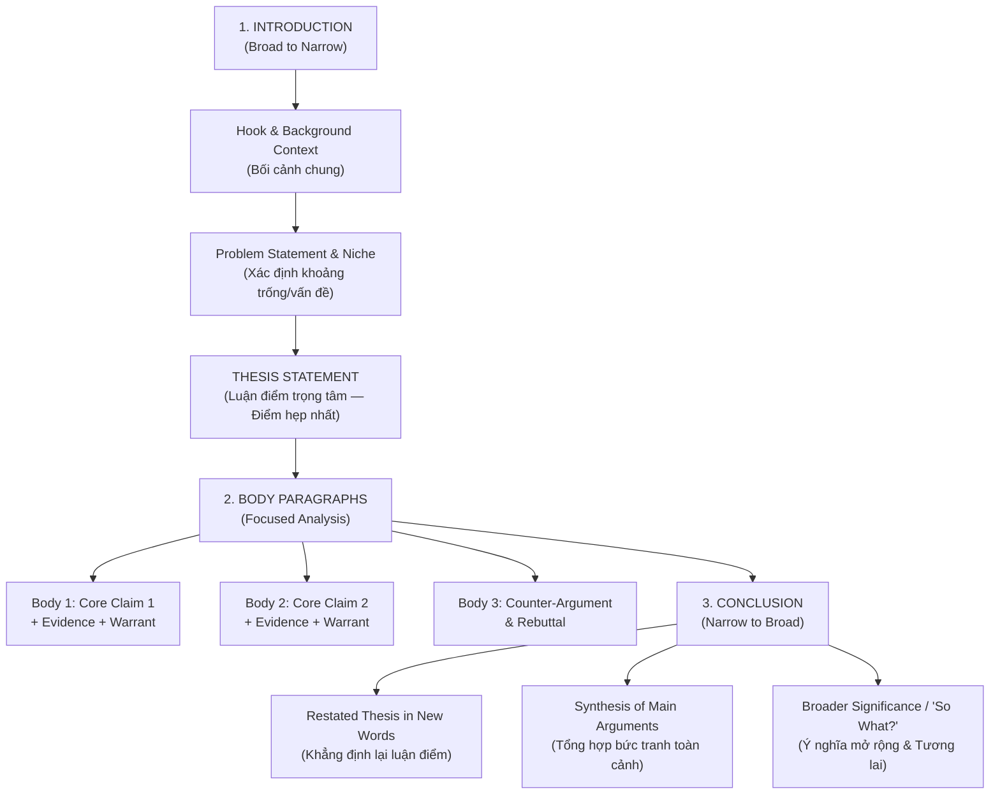
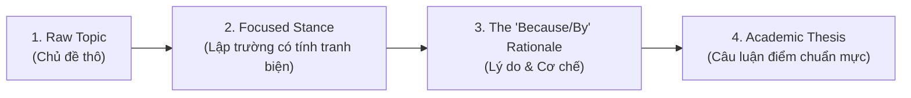

# Magazine 01: The Blueprint of Academic Writing — Anatomy, Reader Expectation & Thesis Power

## Magazine.01: The Blueprint of Academic Writing — Anatomy, Reader Expectation & Thesis Power

*Theme: Mastering the Macro Architecture of Scholarly Essays, Engineering Arguable Thesis Statements, and Adopting an Objective Scholarly Voice.*

---

### 本期速览 / Quick Preview

<!-- visual: steps | id: S01 | title: 本期速览 / Quick Preview | purpose: 快速了解本期核心脉络 -->

<ol>
  <li><strong>Step 1 — Giải mã cấu trúc (Anatomy)</strong>: Hiểu rõ kỳ vọng của người đọc học thuật qua Mô hình Chiếc đồng hồ cát (The Hourglass Model), chuyển từ tư duy "kể chuyện bí ẩn" sang tư duy "cấu trúc định hướng".</li>
  <li><strong>Step 2 — Động cơ luận điểm (Thesis Engine)</strong>: Làm chủ công thức 3 thành phần <code>[Topic] + [Arguable Claim] + [Blueprint / Rationale]</code> để biến các câu trần thuật vô thưởng vô phạt thành luận điểm sắc bén.</li>
  <li><strong>Step 3 — Giọng văn học thuật (Scholarly Voice & Hedging)</strong>: Nâng cấp vốn từ vựng học thuật, làm chủ kỹ thuật nói dè dặt/thận trọng (Hedging) để tăng tính xác thực và khách quan cho bài viết.</li>
</ol>

---

### Block 1: Articles

#### Article A: "Why Your Essay Isn't a Mystery Novel: The Architecture of Reader Expectations"

<!-- visual: photo | id: P01 | title: Scholarly Essay Architecture | purpose: 展示学术严谨的研究与写作场景 -->
<!-- imageQuery: "scholar writing notes at university library desk" | target: "magazine01_reader_expectation.jpg" -->

Trong văn học trinh thám, tác giả cố gắng giấu kín danh tính thủ phạm cho đến trang cuối cùng để tạo sự bất ngờ. Nhưng trong **học thuật (Academic Writing)**, nếu bạn đợi đến đoạn kết luận mới tiết lộ quan điểm chính của mình, bài viết của bạn sẽ bị đánh giá là rời rạc, tối nghĩa và thiếu logic. 

Người đọc học thuật (giáo sư, giám khảo, nhà nghiên cứu) không đọc bài luận của bạn để giải trí hay tìm kiếm bất ngờ. Họ đọc với tâm thế của một **chuyên gia cần trích xuất thông tin nhanh chóng và đánh giá tính hợp lý của lập luận**. Trong ngôn ngữ học ứng dụng, điều này được gọi là phong cách **"Reader-Responsible"** (người viết phải chịu 100% trách nhiệm về sự rõ ràng và tính định hướng cho người đọc).

##### 1. The Hourglass Model: Navigating Broad to Narrow to Broad

Mô hình kinh điển và vững chắc nhất để tổ chức một bài luận học thuật chuẩn mực là **Mô hình Chiếc đồng hồ cát (The Hourglass Model)**. Mô hình này mô phỏng luồng thông tin vận động từ rộng (Broad) sang hẹp (Focused) rồi mở rộng dần (Implications).

<!-- visual: tree | id: T01 | title: The Hourglass Essay Architecture | purpose: 展示学术论文沙漏结构层级与各段核心使命 -->

- **Introduction (Phần Mở bài)**: Bắt đầu từ bối cảnh học thuật rộng lớn, sau đó thu hẹp dần vào vấn đề cụ thể cần giải quyết, và kết thúc bằng câu luận điểm (**Thesis Statement**) — điểm hẹp nhất và quan trọng nhất của phần mở đầu.
- **Body Paragraphs (Phần Thân bài)**: Tập trung sâu vào các luận cứ cụ thể, từng đoạn văn hoạt động như một khối gạch độc lập nhưng được gắn kết chặt chẽ để chứng minh cho Thesis Statement.
- **Conclusion (Phần Kết bài)**: Khởi đầu bằng việc nhắc lại luận điểm bằng từ ngữ mới (Paraphrase), sau đó mở rộng tầm nhìn để trả lời câu hỏi *"So what?"* (Nghiên cứu này có ý nghĩa gì đối với thực tiễn hoặc lĩnh vực nghiên cứu rộng hơn?).

##### 2. The Three Pillars of Academic Prose: Structure, Logic, and Register

Một bài viết học thuật thành công luôn đứng vững trên **3 trụ cột cốt lõi**:

<!-- visual: blocks | id: B01 | title: The Academic Discourse Engine | purpose: 展示结构、逻辑与语域的协同工作流 -->

  

    

      
1. Macro Structure

      
Cấu trúc phân tầng rõ ràng (Hourglass Model, Topic Sentences, Transitions)

    

    
→

    

      
2. Critical Logic

      
Lập luận chặt chẽ (Claim + Evidence + Warrant, Toulmin Model)

    

    
→

    

      
3. Scholarly Register

      
Ngữ vực học thuật chuẩn xác (Objective Tone, Hedging, Precision)

    

  

  
Hình B01: Động cơ 3 trụ cột của văn phong học thuật chuẩn mực

1. **Macro Structure (Cấu trúc vĩ mô)**: Mỗi đoạn văn phải có một chức năng xác định trong việc phục vụ luận điểm chung.
2. **Critical Logic (Logic phản biện)**: Không đưa ra bất kỳ khẳng định (Claim) nào mà không có bằng chứng (Evidence) và lời giải thích liên kết (Warrant).
3. **Scholarly Register (Ngữ vực học thuật)**: Tránh cảm xúc cá nhân hóa, từ ngữ thông tục và những khẳng định võ đoán không có căn cứ.

##### 3. Overcoming the "Blank Page Panic": Structuring Before Drafting

Một lỗi phổ biến của người mới bắt đầu là mở tệp tài liệu trắng và cố gắng viết hoàn hảo ngay từ câu đầu tiên. Các học giả chuyên nghiệp không bao giờ viết theo cách đó. Họ áp dụng nguyên tắc **"Outline First, Draft Second"**. 

  <h4>📚 Cơ sở nghiên cứu: John Swales' CARS Model</h4>
  
Nhà ngôn ngữ học nổi tiếng <strong>John Swales (1990)</strong> đã phát triển mô hình <em>CARS (Creating a Research Space)</em> chứng minh rằng mọi phần mở đầu học thuật thành công đều tuân theo 3 bước di chuyển (Moves): <strong>Move 1 (Establishing a territory)</strong> $\to$ <strong>Move 2 (Establishing a niche/problem)</strong> $\to$ <strong>Move 3 (Occupying the niche via Thesis)</strong>.

Trước khi viết bất kỳ câu văn nào, bạn phải có một sơ đồ phân nhánh thể hiện rõ mối liên kết giữa từng luận điểm phụ (Topic Sentence) và luận điểm trung tâm (Thesis Statement).

##### 📚 Key Ideas from This Article

| Concept | Plain meaning | Memory hook | In-context line |
| :--- | :--- | :--- | :--- |
| **Reader Expectation** | Kỳ vọng của người đọc học thuật về sự rõ ràng, tính dự đoán và mạch lạc. | *No surprises, just precision.* | "Academic writing caters to **reader expectation** by placing the core claim at the end of the introduction." |
| **Hourglass Model** 🔁 | Mô hình cấu trúc bài luận: Rộng $\to$ Hẹp (Thesis) $\to$ Rộng (Implications). | *Broad-Narrow-Broad sand glass.* | "The **hourglass model** prevents the essay from drifting into unstructured tangents." |
| **Scholarly Register** | Ngữ vực trang trọng, khách quan, chính xác và không mang tính cảm xúc. | *Formal suit for ideas.* | "Maintaining a consistent **scholarly register** establishes authorial credibility and academic authority." |
| **Topic Sentence** | Câu chủ đề đặt ở đầu đoạn văn, tóm lược luận điểm duy nhất của đoạn đó. | *The mini-thesis of a paragraph.* | "Each body paragraph must be anchored by an explicit **topic sentence**." |

---

#### Article B: "The Thesis Statement Engine: From Generic Topic to Bulletproof Claim"

<!-- visual: photo | id: P02 | title: Engineering the Thesis Statement | purpose: 展示逻辑推导与论点构建过程 -->
<!-- imageQuery: "student analyzing logic map with pen and notebook" | target: "magazine01_thesis_engine.jpg" -->

Nếu bài luận của bạn là một tòa nhà chọc trời, thì **Thesis Statement (Câu luận điểm)** chính là nền móng chịu lực. Nếu nền móng yếu hoặc bị lệch, toàn bộ các đoạn văn thân bài phía trên sẽ sụp đổ, dù từ vựng hay ngữ pháp của bạn có tinh tế đến đâu.

Một sai lầm chí mạng của người mới học viết luận là nhầm lẫn giữa **Chủ đề (Topic)**, **Sự thật hiển nhiên (Fact)** và **Luận điểm có thể tranh luận (Arguable Thesis)**:
- *Chủ đề (Topic)*: "Artificial Intelligence in healthcare." (Đây chỉ là danh xưng một lĩnh vực, không có lập trường).
- *Sự thật hiển nhiên (Fact)*: "Artificial Intelligence is increasingly used in modern hospitals." (Ai cũng biết điều này, không ai có thể phản bác, do đó không thể viết thành bài luận tranh biện).
- *Luận điểm học thuật (Arguable Thesis)*: "Although AI enhances diagnostic speed in clinical settings, its implementation must be regulated by standardized oversight frameworks to prevent algorithmic bias and accountability deficits." (Có lập trường rõ ràng, có đối tượng tranh luận, có định hướng phân tích).

##### 1. The Tripartite Anatomy: Topic + Claim + Blueprint

Một câu Thesis Statement hoàn chỉnh và mạnh mẽ trong bài luận học thuật luôn được cấu thành từ **3 thành phần không thể tách rời**:

<!-- visual: flow | id: F01 | title: The Thesis Generation Pipeline | purpose: 从粗糙想法到高阶学术论点的 4 步升阶流程 -->

<!-- visual: formula | id: M01 | title: The 3-Part Thesis Formula | purpose: 公式化展示有效论点的构成要素 -->

  
Thesis = [Specific Topic] + [Arguable Claim] + [Blueprint / Rationale (Why/How)]

  
Công thức: [Chủ đề cụ thể] + [Lập trường có thể phản biện] + [Lý do / Lộ trình chứng minh (Vì sao / Bằng cách nào)]

1. **Specific Topic (Chủ đề được thu hẹp)**: Giới hạn rõ phạm vi đối tượng nghiên cứu (ví dụ: không nói "công nghệ nói chung", mà nói "việc áp dụng AI trong chẩn đoán hình ảnh y khoa").
2. **Arguable Claim (Khẳng định có thể tranh biện)**: Đưa ra một nhận định mà một người có tư duy lý trí hoàn toàn có thể **bất đồng quan điểm** với bạn.
3. **Blueprint / Rationale (Lộ trình chứng minh / Lý do cốt lõi)**: Báo trước cho người đọc biết bạn sẽ chứng minh lập trường đó dựa trên những khía cạnh nào (ví dụ: *economic feasibility, ethical constraints, and technological efficacy*).

##### 2. The Deconstruction Clinic: Weak vs. Strong Thesis Transformations

Hãy cùng giải phẫu các trường hợp biến đổi từ câu luận điểm yếu sang luận điểm học thuật tiêu chuẩn qua bảng đối chiếu dưới đây:

<!-- visual: table | id: T02 | title: Weak vs. Strong Thesis Statements | purpose: 对比事实陈述、主观意见与学术有效论点的本质区别 -->

#### Deconstruction Table: Thesis Upgrade

| Trường hợp | Bản thảo sơ khai (Weak / Draft) | Bản nâng cấp học thuật (Strong / Scholarly) | Phân tích giải phẫu |
| :--- | :--- | :--- | :--- |
| **Case 1: Climate Policy** | *"Global warming is a very bad issue and governments should do something about it."* | *"To mitigate the accelerated impacts of climate change, developing economies must prioritize decentralized renewable microgrids over centralized fossil infrastructure due to their cost-efficiency and regional resilience."* | Từ chỗ than phiền cảm tính $\to$ Xác định giải pháp cụ thể (*decentralized microgrids*) + Lý do rõ ràng (*cost-efficiency, resilience*). |
| **Case 2: Online Education** | *"Online learning has both pros and cons for university students."* | *"While online learning offers unprecedented geographical flexibility, it diminishes long-term conceptual retention unless structured around synchronous collaborative problem-solving."* | Từ chỗ ba phải, chung chung $\to$ Thừa nhận phản biện (*flexibility*) nhưng khẳng định điều kiện tiên quyết (*collaborative problem-solving*). |
| **Case 3: Social Media** | *"Social media makes young people addicted and unhappy."* | *"The pervasive algorithmic architecture of contemporary social media platforms amplifies adolescent anxiety by incentivizing superficial validation metrics and disrupting circadian sleep cycles."* | Thay thế định kiến cảm tính bằng cơ chế vận hành cụ thể (*algorithmic architecture, validation metrics, circadian disruption*). |

##### 3. The Litmus Test: Is Your Thesis Arguable and Falsifiable?

Làm thế nào để biết câu Thesis của bạn đã đạt chuẩn hay chưa? Hãy áp dụng phép thử **"The Counter-Thesis Test"**:
*Nếu bạn đảo ngược câu Thesis của mình, liệu có một người thông minh, có học thức nào sẵn sàng đứng ra bảo vệ quan điểm đối nghịch đó không?*

  <h4>⚠️ Bẫy thường gặp: Lập luận đạo đức bất khả phản bác</h4>
  
Nếu câu Thesis của bạn là <em>"Trẻ em cần được giáo dục tốt để có tương lai tươi sáng"</em>, thì câu đối nghịch sẽ là <em>"Trẻ em không nên được giáo dục"</em>. Vì không ai có thể bảo vệ câu đối nghịch ngớ ngẩn này, nên câu ban đầu của bạn <strong>không phải là một Thesis Statement học thuật</strong>, mà chỉ là một lời tuyên bố đạo đức vô giá trị trong nghiên cứu.

##### 📚 Key Ideas from This Article

| Concept | Plain meaning | Memory hook | In-context line |
| :--- | :--- | :--- | :--- |
| **Thesis Statement** 🔁 | Câu luận điểm trọng tâm mang tính học thuật, định hướng cho toàn bộ bài viết. | *The rudder of the academic ship.* | "A robust **thesis statement** provides both an arguable claim and an analytical roadmap." |
| **Arguability** | Tính chất có thể tranh luận, cho phép tồn tại quan điểm trái chiều hợp lý. | *Inviting a worthy opponent.* | "Without **arguability**, an essay degenerates into an unengaging factual report." |
| **Blueprint / Roadmap** | Phần trong câu Thesis nêu rõ các nhánh lập luận chính sẽ triển khai ở thân bài. | *The preview of coming chapters.* | "The **blueprint** within the thesis signals the exact sequence of body arguments." |
| **Falsifiability** | Khả năng kiểm chứng và có thể bị chứng minh là sai bằng bằng chứng đối nghịch. | *Open to rational debate.* | "Academic claims must possess **falsifiability** to remain scientifically meaningful." |

---

#### Article C: "The Scholarly Persona: Objective Stance, Hedging & Register Upgrades"

<!-- visual: photo | id: P03 | title: The Scholarly Persona and Academic Tone | purpose: 展示学术严谨态度与客观立场 -->
<!-- imageQuery: "professor reviewing research manuscript with magnifying glass" | target: "magazine01_scholarly_stance.jpg" -->

Nhiều người lầm tưởng rằng để tỏ ra tự tin trong bài viết, họ phải dùng những từ ngữ đao to búa lớn như *"This proves beyond all doubt"*, *"It is 100% obvious that..."*, hoặc *"Everyone agrees that..."*. 

Trong cộng đồng học thuật quốc tế, lối viết tuyệt đối hóa này bị xem là **ngây thơ và thiếu chín chắn về mặt học thuật (Academic Naivety)**. Thế giới khoa học và xã hội vô cùng phức tạp; mọi kết luận đều phụ thuộc vào điều kiện biên, cỡ mẫu và phương pháp luận. Do đó, kỹ năng quan trọng nhất để tạo nên phong thái học giả (Scholarly Persona) chính là **Hedging (Kỹ thuật diễn đạt cẩn trọng/dè dặt)**.

##### 1. The Art of Academic Hedging: Caution is Precision, Not Weakness

Hedging không phải là sự tự ti, mà là **đỉnh cao của sự chính xác khoa học**. Nó bảo vệ bạn khỏi việc bị bác bỏ hoàn toàn khi có trường hợp ngoại lệ xuất hiện.

<!-- visual: table | id: T03 | title: The Hedging Ladder | purpose: 从绝对断言到精准学术谨慎语的阶梯对照 -->

#### The Hedging Ladder: Từ Tuyệt đối hóa đến Chuẩn mực Học thuật

| Mức độ | Câu tuyệt đối hóa (Unhedged / Dogmatic) | Câu học thuật có chừng mực (Hedged / Scholarly) | Kỹ thuật sử dụng |
| :--- | :--- | :--- | :--- |
| **Level 1: Động từ tình thái (Modals)** | *"Remote work **destroys** company culture."* | *"Remote work **may disrupt** traditional mechanisms of organizational culture."* | Dùng *may / might / can / could* thay cho khẳng định tuyệt đối. |
| **Level 2: Động từ dè dặt (Cautious Verbs)** | *"This experiment **proves** that our theory is correct."* | *"These findings **suggest** that the proposed model **tends to** account for the observed variance."* | Dùng *suggests / indicates / points to / tends to* thay cho *proves / demonstrates conclusively*. |
| **Level 3: Trạng từ xác suất (Probability Adverbs)** | *"Students **always** lose focus during long lectures."* | *"Students **frequently** exhibit reduced attentional engagement during extended lectures."* | Dùng *frequently / predominantly / likely / arguably* thay cho *always / completely / definitely*. |
| **Level 4: Giới hạn phạm vi (Limiting Conditions)** | *"Social media causes depression."* | *"Under conditions of prolonged passive consumption, social media use **appears to correlate with** elevated depressive symptoms in adolescents."* | Bổ sung điều kiện biên (*under conditions of...*) và thay nguyên nhân trực tiếp bằng mối tương quan (*correlate with*). |

##### 2. Lexical Upgrades: Banishing Conversational Slang

Học thuật không chấp nhận các cụm động từ (phrasal verbs) mơ hồ hay các từ đệm cảm tính của đời sống hàng ngày. Hãy quan sát bảng nâng cấp từ vựng dưới đây:

<!-- visual: table | id: T04 | title: Academic Vocabulary Level-Up Matrix | purpose: 常用口语动词与副词向正式学术语汇转换表 -->

#### Academic Vocabulary Level-Up Matrix

| Khái niệm thông thường (Informal / Spoken) | Thuật ngữ học thuật nâng cấp (Scholarly / Formal) | Ví dụ ứng dụng trong câu |
| :--- | :--- | :--- |
| **think / believe** | **argue / contend / assert / maintain** | *"Scholars **contend** that economic disparity drives political polarization."* |
| **show** | **demonstrate / elucidate / illustrate / reveal** | *"The statistical data **elucidates** the relationship between urban density and emissions."* |
| **get rid of** | **eliminate / eradicate / phase out** | *"Policymakers aim to **phase out** regressive subsidies."* |
| **a lot of / big** | **substantial / considerable / profound / pivotal** | *"The transition represents a **substantial** paradigm shift in renewable economics."* |
| **look into** | **investigate / examine / scrutinize / evaluate** | *"This chapter **scrutinizes** the empirical validity of the initial hypothesis."* |
| **fix the problem** | **address the issue / rectify the deficiency / remediate** | *"Targeted fiscal interventions are required to **rectify these systemic deficiencies**."* |

##### 3. Active vs. Passive Voice in Academic Discourse

Có một huyền thoại cho rằng văn phong học thuật luôn phải dùng câu bị động (Passive Voice). Thực tế, văn phong học thuật hiện đại đề cao sự cân bằng:
- **Dùng Thể chủ động (Active Voice)** khi cần nhấn mạnh hành động hoặc mối quan hệ nhân quả rõ ràng: *"Smith (2021) argues that institutional trust mediates compliance."*
- **Dùng Thể bị động (Passive Voice)** khi cần làm nổi bật phương pháp, kết quả hoặc khi danh tính người thực hiện không quan trọng: *"The blood samples were centrifuged at 3000 rpm for 15 minutes."*

  <h4>💡 Mẹo chuyên nghiệp: Thể hiện lập trường không cần dùng "I"</h4>
  
Thay vì viết <em>"I think this policy is ineffective"</em>, bạn hãy viết <em>"A rigorous analysis of recent fiscal outcomes reveals significant policy inefficacy."</em> Bằng cách biến <strong>bằng chứng và phương pháp</strong> thành chủ ngữ, bài viết của bạn sẽ lập tức toát lên sức nặng khách quan và uy tín học thuật.

##### 📚 Key Ideas from This Article

| Concept | Plain meaning | Memory hook | In-context line |
| :--- | :--- | :--- | :--- |
| **Hedging** 🔁 | Kỹ thuật dùng từ ngữ dè dặt, thận trọng để tránh khẳng định tuyệt đối hóa. | *Academic shock absorbers.* | "Effective **hedging** ensures that conclusions do not exceed the empirical scope of the data." |
| **Objective Stance** | Lập trường khách quan, dựa trên luận cứ thay vì thiên kiến hoặc cảm xúc cá nhân. | *Evidence in the driver's seat.* | "An **objective stance** is maintained by foregrounding the phenomena rather than personal belief." |
| **Lexical Precision** | Tính chuẩn xác của từ vựng, loại bỏ khẩu ngữ và cụm từ mơ hồ. | *Upgrading to surgical tools.* | "High-scoring academic essays demand **lexical precision** across all analytical claims." |
| **Limiting Condition** | Điều kiện biên xác định phạm vi mà tại đó nhận định được coi là đúng đắn. | *Setting the boundary fence.* | "Specifying **limiting conditions** prevents unwarranted over-generalizations." |

---

### Block 2: How Do I Apply This?

#### 📌 Scenario Card 1: Cải tạo Mở bài "Hội chứng Chuyện cổ tích"

- **Tình huống**: Bạn được giao đề tài *"Đánh giá tác động của làm việc từ xa (Remote Work) đối với sự gắn kết của nhân viên"*. Bạn bắt đầu mở bài bằng câu: *"Từ xưa đến nay, con người luôn phải đi làm để kiếm sống. Ngày nay công nghệ phát triển nên có nhiều người làm việc ở nhà..."*
- **Lỗi sai thường gặp**: Mở đầu bằng sáo ngữ vô nghĩa (*"Từ xưa đến nay..."*), lan man, không có bối cảnh học thuật và câu luận điểm bị chìm nghỉm.
- **Cách xử lý chuẩn mực**: Áp dụng mô hình **Hourglass & CARS**:
  1. *Move 1 (Bối cảnh học thuật)*: Xác lập xu hướng chuyển dịch lao động hậu đại dịch và sự phân hóa trong mô hình tổ chức.
  2. *Move 2 (Vấn đề nghiên cứu)*: Nhấn mạnh sự mâu thuẫn giữa tính linh hoạt cá nhân và sự suy giảm gắn kết tập thể.
  3. *Move 3 (Thesis Statement sắc bén)*: *"Although remote work substantially enhances individual scheduling autonomy, it attenuates organizational cohesion unless organizations implement structured synchronous touchpoints and equitable digital evaluation metrics."*

#### 📌 Scenario Card 2: Biến Đổi Luận Điểm "Ba Phải" Thành Luận Điểm Sắc Bén

- **Tình huống**: Bạn muốn viết bài về việc cấm xe máy chạy xăng ở các đô thị lớn. Bạn dự định viết Thesis: *"Việc cấm xe máy chạy xăng có cả mặt lợi và mặt hại cho người dân thành phố."*
- **Lỗi sai thường gặp**: Câu này không phải là luận điểm vì nó không có lập trường (Neutral/Trivial). Người đọc không biết tác giả nghiêng về bên nào và sẽ chứng minh điều gì.
- **Cách xử lý chuẩn mực**: Áp dụng công thức 3 thành phần `[Topic] + [Arguable Claim] + [Blueprint]`:
  - *Bản nâng cấp*: *"While a blanket prohibition on gasoline motorcycles imposes immediate economic burdens on lower-income commuters, metropolitan authorities must enforce phased restrictions coupled with subsidized electric transit alternatives to systematically reduce critical urban particulate emissions."*

---

### Block 3: Warehouse Toolkit — Thesis Statement Strength Tester

<!-- visual: table | id: T05 | title: The 3-Dimensional Thesis Strength Tester | purpose: 检验论点强度的自测指标卡片 -->

#### 🧰 Bảng Tự Đánh Giá Độ Mạnh Của Câu Luận Điểm (Thesis Strength Tester)

Trước khi bắt tay vào viết thân bài, hãy chấm điểm câu Thesis của bạn theo 3 tiêu chí dưới đây (Mỗi tiêu chí từ 1 đến 5 điểm; đạt $\ge 12/15$ điểm mới được coi là an toàn để bắt đầu viết):

| Tiêu chí kiểm định (Dimension) | Câu hỏi tự chất vấn (Diagnostic Question) | Dấu hiệu báo động (Red Flags - 1-2 điểm) | Chuẩn mực học thuật (Gold Standard - 4-5 điểm) |
| :--- | :--- | :--- | :--- |
| **1. Specificity (Độ cụ thể của phạm vi)** | *Câu văn có khu biệt rõ đối tượng, bối cảnh và điều kiện biên không?* | Dùng từ mơ hồ: *things, society, people, big changes, good/bad*. | Xác định rõ chủ thể: *developing economies, urban adolescents, clinical AI systems*. |
| **2. Arguability (Tính có thể tranh biện)** | *Có ai có học thức sẵn sàng phản biện lại quan điểm này của bạn không?* | Phát biểu chân lý hiển nhiên: *Pollution is bad; Education is important*. | Đưa ra lập trường có đối trọng: *Prioritizing X over Y under condition Z*. |
| **3. Roadmap / Blueprint (Định hướng phân tích)** | *Câu văn có chỉ ra "Vì sao" (Why) hoặc "Bằng cách nào" (How) bài viết sẽ chứng minh luận điểm không?* | Chỉ dừng lại ở phát biểu cụt ngủn: *X is true.* | Nêu rõ 2–3 cơ chế trụ cột: *...due to its cost-efficiency and regional resilience.* |

---

### Block 4: Quick Check

#### MCQ-1
Stem: Trong các câu dưới đây, câu nào cấu thành một **Thesis Statement học thuật đạt chuẩn** cho một bài luận tranh biện về trí tuệ nhân tạo trong giáo dục?
- [ ] A. Artificial intelligence is a rapidly growing technology that is being used in many schools worldwide.
- [ ] B. While AI-driven adaptive platforms enhance personalized learning pacing, educational institutions must restrict generative text tools in foundational writing courses to preserve critical cognitive development.
- [ ] C. I believe that artificial intelligence in modern classrooms has both positive and negative aspects for students and teachers.
- [ ] D. Technology in classrooms is very helpful because it makes learning fun and prepares kids for the future.
<!-- answer: B | rationale: Option B satisfies all 3 criteria: Specific Topic (AI in foundational writing), Arguable Claim (must restrict generative tools), and Rationale/Blueprint (to preserve critical cognitive development). Option A is a mere fact; Option C is neutral/vague; Option D is informal and unarguable. -->

#### MCQ-2
Stem: Kỹ thuật **Hedging** được thể hiện chuẩn xác nhất trong câu nào dưới đây?
- [ ] A. This research definitely proves that social media completely destroys teen mental health.
- [ ] B. Everyone knows that smartphones are always harmful to child development.
- [ ] C. Preliminary findings suggest that excessive screen exposure may correlate with diminished attention span under specific developmental conditions.
- [ ] D. It is 100% obvious that technology is the sole cause of student failure in universities.
<!-- answer: C | rationale: Option C uses cautious language (Preliminary findings suggest, may correlate with, under specific conditions), avoiding dogmatic overgeneralization. -->

#### TF-1
命题: Trong cấu trúc The Hourglass Model, phần Mở bài (Introduction) luôn đi từ luận điểm hẹp (Thesis) ở câu đầu tiên rồi mới mở rộng dần ra bối cảnh chung ở cuối đoạn.
- [ ] True
- [ ] False
- <!-- answer: False | flaw: The Hourglass Model moves from BROAD (Context/Hook) to NARROW (Thesis Statement at the end of the introduction), not the reverse. -->

#### TF-2
命题: Một câu phát biểu chân lý hiển nhiên không thể bị phản bác (ví dụ: "Tập thể dục thường xuyên rất tốt cho sức khỏe") là một Thesis Statement lý tưởng vì nó luôn luôn đúng.
- [ ] True
- [ ] False
- <!-- answer: False | flaw: A valid academic thesis requires arguability and falsifiability. An indisputable moral or factual truism leaves no room for debate or analytical defense. -->

#### Exercise 1 — Thesis Formulation Lab
Đề bài giả định: *Nhiều thành phố đang xem xét việc miễn phí toàn bộ phương tiện giao thông công cộng (Free Public Transit). Hãy đóng vai một nhà phân tích chính sách học thuật, viết 01 câu Thesis Statement hoàn chỉnh (áp dụng công thức Topic + Arguable Claim + Blueprint) thể hiện lập trường của bạn về vấn đề này.*

*   **[Your Answer]**:

---

### 三句话总结 / 3 Key Takeaways

<!-- visual: callout | id: C04 | title: 三句话总结 / 3 Key Takeaways | purpose: 提炼全篇核心认知 -->

  <h4>🎯 3 Key Takeaways từ Magazine 01</h4>
  
1. <strong>Kiến trúc định hướng (Reader Expectation)</strong>: Viết học thuật tuân theo mô hình Chiếc đồng hồ cát (The Hourglass Model) — rõ ràng, có thể dự đoán và tuyệt đối không giấu giếm luận điểm như tiểu thuyết trinh thám.

  
2. <strong>Luận điểm có tính phản biện (Arguable Thesis)</strong>: Một Thesis Statement vững chắc phải hội đủ 3 yếu tố: <code>Chủ đề cụ thể + Lập trường có thể tranh biện + Lộ trình lý giải (Why/How)</code>.

  
3. <strong>Phong thái học giả (Scholarly Voice)</strong>: Sức mạnh thuyết phục của văn phong học thuật đến từ sự chuẩn xác của từ ngữ chuyên ngành và kỹ thuật diễn đạt dè dặt (Hedging) có căn cứ, chứ không đến từ những khẳng định cảm tính hay tuyệt đối hóa.

---

> 💡 **Hướng dẫn tiếp theo**:  
> 1. Hãy mở trình đọc bằng cách chạy file `start.bat` (hoặc truy cập `http://127.0.0.1:4173`).  
> 2. Đọc bài, sử dụng chuột bôi đen các từ vựng/khái niệm để tạo ghi chú (Notes/Highlight).  
> 3. Hoàn thành các câu trắc nghiệm và gõ câu trả lời của bạn vào ô `[Your Answer]` ở cuối bài.  
> 4. Sau khi hoàn thành, hãy nhắn **「帮我批改」** (hoặc *"Chấm bài giúp tôi"* / *"Review my work"*) để chuyển sang **Phase 3 (Chấm điểm, phân tích lỗi sai và mở khóa Unit tiếp theo)**!
