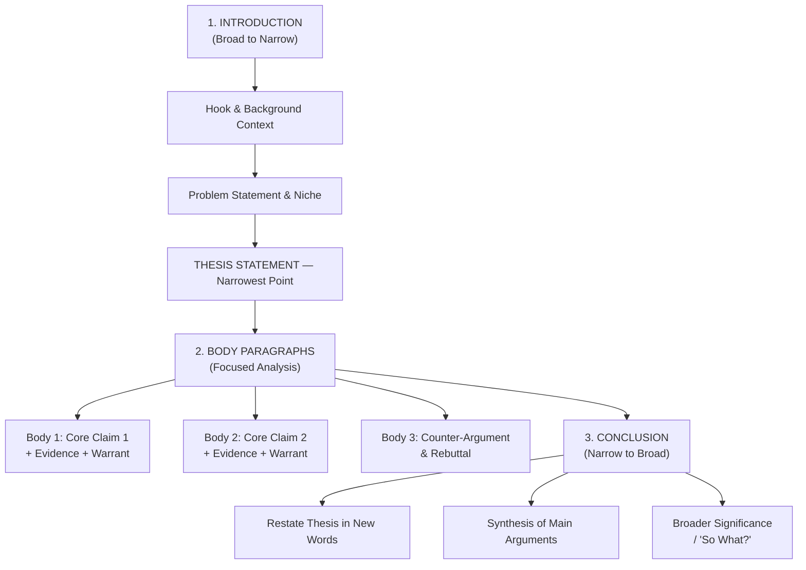
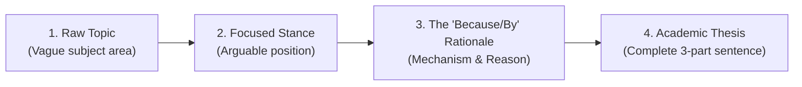

# Unit 01: 5-Day Blueprint — Day-by-Day Curriculum (Day 01–05)

## Unit 01: 5-Day Blueprint — From Zero to Academic Writer

*Based on: Magazine 01 — The Blueprint of Academic Writing*  
*Total study time: ~5 hours (≈ 60 min/day)*

---

### 本单元速览 / Unit Quick Preview

<!-- visual: steps | id: S00 | title: 5-Day Learning Path | purpose: 每日学习路径总览 -->

<ol>
  <li><strong>Day 1 — Reader Expectation & The Hourglass Model</strong>: Understand why academic writing must never behave like a mystery novel. Master the Broad → Narrow → Broad architecture.</li>
  <li><strong>Day 2 — The Three Pillars & Blank-Page Strategy</strong>: Internalize Structure, Logic and Register as the three load-bearing columns of every scholarly essay. Learn the "Outline First" method.</li>
  <li><strong>Day 3 — Engineering the Thesis Statement</strong>: Distinguish Topics, Facts and Arguable Claims. Apply the 3-part formula and the Counter-Thesis litmus test.</li>
  <li><strong>Day 4 — Scholarly Voice, Hedging & Vocabulary</strong>: Upgrade informal language to academic register. Master the four levels of hedging and active/passive voice balance.</li>
  <li><strong>Day 5 — Integration, Application & Review</strong>: Apply all skills in realistic scenario cards, self-assess thesis strength, complete Quick Check exercises and consolidate takeaways.</li>
</ol>

---

## 📅 Day 1 — Reader Expectation & The Hourglass Model

*Daily goal: Understand the fundamental contract between academic writer and reader, and map the Hourglass structure.*  
⏱ Estimated time: ~60 min

---

### 📖 Reading Focus

**From Article A**: Read the opening two paragraphs of *"Why Your Essay Isn't a Mystery Novel"* and Section **1. The Hourglass Model**.

> *Key passage*: "Academic readers do not read your essay for entertainment or surprises. They read with the mindset of an expert needing to extract information quickly and evaluate the logic of the argument."

---

### 🗺️ Core Concept Map

<!-- visual: photo | id: P_HG | title: The Hourglass Model | purpose: 直观展示论文沙漏结构 -->

*Hình trên: Mô hình Chiếc đồng hồ cát (The Hourglass Model) — phần Mở bài thu hẹp từ rộng đến điểm hẹp nhất là Thesis Statement, sau đó phần Thân bài và Kết bài mở rộng trở lại.*

<!-- visual: flow | id: F01 | title: The Hourglass Flowchart | purpose: 流程图展示论文沙漏结构 -->

---

### 📚 Day 1 Key Vocabulary

| Concept | Plain meaning | Memory hook |
| :--- | :--- | :--- |
| **Reader Expectation** | Academic readers demand clarity and predictability — no surprises. | *No surprises, just precision.* |
| **Hourglass Model** | Essay structure: Broad → Narrow (Thesis) → Broad (Implications). | *Sand-glass: wide → pinch → wide.* |
| **Scholarly Register** | Formal, objective, emotion-free academic voice. | *A formal suit for your ideas.* |
| **Topic Sentence** | The mini-thesis that opens each body paragraph. | *The mini-thesis of a paragraph.* |

---

### ✍️ Day 1 Practice Activity

**Task**: Look at the following introduction paragraph. Label each sentence with its Hourglass role: **Hook / Background**, **Problem Statement**, or **Thesis Statement**.

> *"The proliferation of generative AI tools has reshaped the landscape of higher education across the globe [___]. Despite widespread institutional adoption, the pedagogical consequences for foundational writing competency remain contested and poorly documented [___]. This paper argues that unrestricted access to large language models in undergraduate composition courses systematically atrophies critical argumentation skills unless counterbalanced by structured metacognitive writing workshops [___]."*

**[Your Labels — fill in the blanks]**:

*   **Sentence 1**: ___________
*   **Sentence 2**: ___________
*   **Sentence 3**: ___________

---

### ✅ Day 1 Self-Check

- [ ] I can explain why the Thesis Statement goes at the *end* of the Introduction, not the beginning.
- [ ] I can describe all three sections of the Hourglass Model and their directional logic.
- [ ] I understand the difference between a Topic Sentence and a Thesis Statement.

---

## 📅 Day 2 — The Three Pillars & The Blank-Page Strategy

*Daily goal: Understand what makes academic prose structurally sound, and adopt the professional "Outline First" approach.*  
⏱ Estimated time: ~55 min

---

### 📖 Reading Focus

**From Article A**: Sections **2. The Three Pillars** and **3. Overcoming the "Blank Page Panic"** — including the science note on **John Swales' CARS Model**.

---

### 🗺️ Core Concept Map

<!-- visual: blocks | id: B02 | title: The Academic Discourse Engine | purpose: 三支柱协同工作流 -->

  

    

      
1. Macro Structure

      
Clear hierarchical layout — Hourglass, Topic Sentences, Transitions

    

    
→

    

      
2. Critical Logic

      
Tight argumentation — Claim + Evidence + Warrant (Toulmin Model)

    

    
→

    

      
3. Scholarly Register

      
Precise academic voice — Objective Tone, Hedging, Precision

    

  

  
The Academic Discourse Engine: all three pillars must be active simultaneously.

---

### 📚 Day 2 Key Vocabulary

| Concept | Plain meaning | Memory hook |
| :--- | :--- | :--- |
| **Macro Structure** | The large-scale architecture: Intro → Body → Conclusion, with each paragraph serving a defined role. | *Blueprint before bricks.* |
| **Critical Logic** | Every claim must be paired with evidence and a connecting warrant (the "why it matters" bridge). | *No naked claims allowed.* |
| **CARS Model** | Swales' 3-Move pattern for introductions: Establish Territory → Establish Niche → Occupy Niche. | *Territory → Problem → Thesis.* |
| **Outline First** | Professional writers build a structural map before drafting any sentences. | *Architect before builder.* |

---

### ✍️ Day 2 Practice Activity

**Task — CARS Move Mapping**: Using Swales' model, write a one-sentence placeholder for each Move for the topic below:

*Topic: "The effect of sleep deprivation on university students' exam performance"*

- **Move 1 — Establish Territory** (broad academic context): ___________
- **Move 2 — Establish Niche / Problem** (what gap or tension exists): ___________
- **Move 3 — Occupy Niche** (your thesis): ___________

---

### ✅ Day 2 Self-Check

- [ ] I can name and explain all three pillars of academic prose.
- [ ] I understand the Claim → Evidence → Warrant structure for body paragraphs.
- [ ] I can apply Swales' 3-Move CARS model to plan an introduction.
- [ ] I commit to outlining before drafting in all future academic writing.

---

## 📅 Day 3 — Engineering the Thesis Statement

*Daily goal: Reliably distinguish weak from strong thesis statements and produce a 3-part arguable thesis.*  
⏱ Estimated time: ~65 min

---

### 📖 Reading Focus

**From Article B**: All three sections — *Tripartite Anatomy*, *Deconstruction Clinic*, and *The Litmus Test*.

---

### 🗺️ Thesis Generation Pipeline

<!-- visual: flow | id: F02 | title: Thesis Generation Pipeline | purpose: 展示三段式论点提炼流程 -->

<!-- visual: formula | id: M02 | title: The 3-Part Thesis Formula | purpose: 三段式论点公式 -->

  
Thesis = [Specific Topic] + [Arguable Claim] + [Blueprint / Rationale (Why/How)]

  
Ask yourself: "Could a reasonable, intelligent person disagree with this?" If yes → your thesis is arguable.

---

### 📚 Day 3 Key Vocabulary

| Concept | Plain meaning | Memory hook |
| :--- | :--- | :--- |
| **Thesis Statement** | The single central arguable claim that anchors the entire essay. | *The rudder of the academic ship.* |
| **Arguability** | The quality of inviting rational disagreement — not a fact, not an opinion. | *Inviting a worthy opponent.* |
| **Blueprint / Roadmap** | The part of the thesis that previews the main analytical branches. | *The preview of coming chapters.* |
| **Falsifiability** | The claim could, in principle, be disproved by contrary evidence. | *Open to rational debate.* |

---

### 🔬 Deconstruction Clinic — Reference Table

| Case | Weak Draft | Strong Scholarly Thesis |
| :--- | :--- | :--- |
| **Climate Policy** | *"Global warming is a very bad issue."* | *"Developing economies must prioritize decentralized renewable microgrids over centralized fossil infrastructure due to their cost-efficiency and regional resilience."* |
| **Online Education** | *"Online learning has both pros and cons."* | *"While online learning offers geographical flexibility, it diminishes conceptual retention unless structured around synchronous collaborative problem-solving."* |
| **Social Media** | *"Social media makes young people unhappy."* | *"The algorithmic architecture of social media amplifies adolescent anxiety by incentivizing superficial validation metrics and disrupting circadian sleep cycles."* |

---

### ✍️ Day 3 Practice Activity

**Thesis Upgrade Lab** — Transform each weak statement into a full 3-part academic thesis:

1. *Weak*: "Climate change is a serious global problem." → **[Your strong thesis]**: ___________
2. *Weak*: "Students who study abroad have many new experiences." → **[Your strong thesis]**: ___________

**Counter-Thesis Test** — For each thesis you wrote above, write the opposing thesis in one sentence to verify arguability:
- Counter to thesis 1: ___________
- Counter to thesis 2: ___________

---

### ✅ Day 3 Self-Check

- [ ] I can distinguish between a Topic, a Fact and an Arguable Thesis.
- [ ] I can apply the 3-part formula: Specific Topic + Arguable Claim + Blueprint.
- [ ] I pass every thesis through the Counter-Thesis Test before finalizing it.

---

## 📅 Day 4 — Scholarly Voice, Hedging & Vocabulary Upgrade

*Daily goal: Replace informal language habits with precise academic register and master the 4-level hedging ladder.*  
⏱ Estimated time: ~60 min

---

### 📖 Reading Focus

**From Article C**: All three sections — *The Art of Academic Hedging*, *Lexical Upgrades*, and *Active vs. Passive Voice*.

---

### 🗺️ The Hedging Ladder

<!-- visual: table | id: T06 | title: Hedging Levels | purpose: 四阶段谨慎语梯 -->

| Level | Dogmatic (❌) | Hedged / Scholarly (✅) | Technique |
| :--- | :--- | :--- | :--- |
| **1. Modal Verbs** | *"Remote work destroys company culture."* | *"Remote work **may disrupt** traditional organizational culture."* | Use *may / might / can / could* |
| **2. Cautious Verbs** | *"This proves our theory."* | *"These findings **suggest** the model **tends to** account for the variance."* | Use *suggests / indicates / tends to* |
| **3. Probability Adverbs** | *"Students always lose focus."* | *"Students **frequently** exhibit reduced attentional engagement."* | Use *frequently / predominantly / arguably* |
| **4. Limiting Conditions** | *"Social media causes depression."* | *"Under conditions of prolonged passive consumption, social media **appears to correlate with** depressive symptoms."* | Add boundary conditions + *correlates with* |

---

### 📚 Day 4 Key Vocabulary

| Informal | Academic Upgrade | Example |
| :--- | :--- | :--- |
| think / believe | **argue / contend / assert** | *"Scholars **contend** that disparity drives polarization."* |
| show | **demonstrate / elucidate / reveal** | *"The data **elucidates** the emissions relationship."* |
| a lot of / big | **substantial / considerable / profound** | *"A **substantial** paradigm shift occurred."* |
| look into | **investigate / scrutinize / evaluate** | *"This chapter **scrutinizes** the hypothesis."* |
| fix the problem | **address / rectify / remediate** | *"Fiscal interventions **rectify** systemic deficiencies."* |

---

### ✍️ Day 4 Practice Activity

**Hedging Rewrite Clinic** — Rewrite each dogmatic sentence using the hedging level indicated:

1. *"Technology completely ruins students' ability to think independently."* → Apply **Level 1 + Level 3**: ___________
2. *"This study proves that exercise eliminates anxiety."* → Apply **Level 2 + Level 4**: ___________

**Lexical Upgrade** — Replace the underlined informal words with precise academic vocabulary:

3. *"Researchers **looked into** the **big** effects of poverty on **kids'** health."*  
   → Upgraded: ___________

---

### ✅ Day 4 Self-Check

- [ ] I can identify and apply all four levels of academic hedging.
- [ ] I have replaced at least 5 informal verbs with their academic equivalents in my vocabulary.
- [ ] I know when to use active voice (to foreground agency) vs. passive voice (to foreground method/result).

---

## 📅 Day 5 — Integration, Application & Consolidation

*Daily goal: Synthesize all four days' skills in scenario-based tasks and complete the Quick Check assessment.*  
⏱ Estimated time: ~70 min

---

### 📖 Reading Focus

**Block 2 (Scenario Cards)**, **Block 3 (Thesis Strength Tester)**, **Block 4 (Quick Check exercises)** and the **3 Key Takeaways**.

---

### 🎯 Integration Scenarios

#### Scenario A — Cải tạo Mở bài "Chuyện cổ tích"

- **Context**: You are assigned: *"Evaluate the impact of remote work on employee engagement."*
- **Flawed draft opening**: *"Từ xưa đến nay, con người luôn phải đi làm để kiếm sống. Ngày nay công nghệ phát triển nên có nhiều người làm việc ở nhà..."*

Apply the **CARS + Hourglass** model to rewrite the opening — produce three sentences for Move 1, Move 2 and Move 3 (Thesis):

- **Move 1**: ___________
- **Move 2**: ___________
- **Move 3 (Thesis)**: ___________

#### Scenario B — Thesis Upgrade

- **Weak thesis**: *"Cấm xe máy chạy xăng có cả mặt lợi và mặt hại cho người dân thành phố."*
- Apply `[Topic] + [Arguable Claim] + [Blueprint]`:
- **[Your upgraded thesis]**: ___________

---

### 🧰 Thesis Strength Self-Assessment

Score your Day 3 or Day 5 thesis on each dimension (1–5):

| Dimension | Diagnostic Question | Your Score /5 |
| :--- | :--- | :--- |
| **1. Specificity** | Does it clearly name the subject, context, and boundary conditions? | ___ |
| **2. Arguability** | Would an educated person reasonably disagree? | ___ |
| **3. Blueprint** | Does it signal *why* or *how* the argument will be proven? | ___ |
| **Total** | Must reach ≥ 12/15 before drafting body paragraphs. | ___ /15 |

---

### 📝 Quick Check — Full Assessment

#### MCQ-1
Which sentence is a valid academic thesis statement about AI in education?

- [ ] A. Artificial intelligence is a rapidly growing technology used in many schools worldwide.
- [ ] B. While AI-driven adaptive platforms enhance personalized learning pacing, educational institutions must restrict generative text tools in foundational writing courses to preserve critical cognitive development.
- [ ] C. I believe AI in classrooms has both positive and negative aspects for students.
- [ ] D. Technology in classrooms is helpful because it makes learning fun.
<!-- answer: B | rationale: B satisfies all 3 criteria — Specific Topic, Arguable Claim, and Rationale/Blueprint. A is a fact; C is vague/neutral; D is informal and unarguable. -->

#### MCQ-2
Which sentence demonstrates hedging most accurately?

- [ ] A. This research definitely proves that social media completely destroys teen mental health.
- [ ] B. Everyone knows smartphones are always harmful to child development.
- [ ] C. Preliminary findings suggest that excessive screen exposure may correlate with diminished attention span under specific developmental conditions.
- [ ] D. It is 100% obvious that technology is the sole cause of student failure.
<!-- answer: C | rationale: C uses cautious language — "suggest", "may correlate with", "under specific conditions" — avoiding dogmatic overgeneralization. -->

#### TF-1
In the Hourglass Model, the Introduction begins with the Thesis Statement at the first sentence and then broadens outward.

- [ ] True
- [ ] False
<!-- answer: False | flaw: The Hourglass Model moves from BROAD (Context/Hook) to NARROW (Thesis) — the thesis comes at the END of the introduction, not the beginning. -->

#### TF-2
An indisputable moral truth such as "Regular exercise is good for health" makes an ideal academic thesis because it is always correct.

- [ ] True
- [ ] False
<!-- answer: False | flaw: A valid academic thesis requires arguability and falsifiability. An uncontestable truism has no analytical value and cannot drive a scholarly essay. -->

#### Exercise — Thesis Formulation Lab

*Prompt*: Many cities are considering making all public transit free. Write one complete Thesis Statement (Topic + Arguable Claim + Blueprint) expressing your scholarly position on this policy.

*   **[Your Thesis]**:

---

### 🎯 3 Key Takeaways — Consolidation

<!-- visual: callout | id: C05 | title: 5-Day Consolidation Summary | purpose: 全周核心认知总结 -->

  <h4>🎯 End-of-Week Summary: What You Have Mastered</h4>
  
1. <strong>Reader Architecture (Days 1–2)</strong>: Academic writing is a reader-responsible contract. The Hourglass Model and CARS system give your essay a predictable, navigable structure — never hide the thesis like a mystery novel.

  
2. <strong>Thesis Engineering (Day 3)</strong>: A bulletproof thesis must pass three tests: <code>Specificity + Arguability + Blueprint</code>. Always run the Counter-Thesis Test before committing to a claim.

  
3. <strong>Scholarly Voice (Day 4)</strong>: Precision beats confidence. Replace dogmatic assertions with hedged, condition-bound claims. Upgrade informal vocabulary to precise academic lexis. Let evidence — not emotion — drive every sentence.

---

> 💡 **Next Steps**:
> 1. Run `start.bat` (or visit `http://127.0.0.1:4173`) to open the reader.
> 2. Complete all `[Your Answer]` fields above.
> 3. Once finished, send **「帮我批改」** (*"Review my work"*) to trigger **Phase 3 — Grading & Feedback** and unlock the next magazine!
